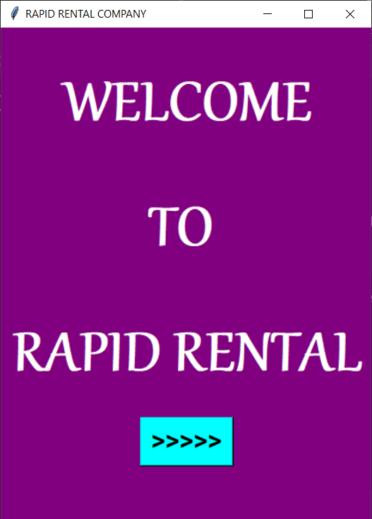
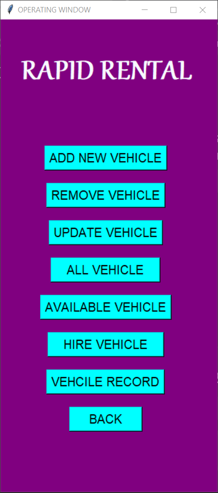
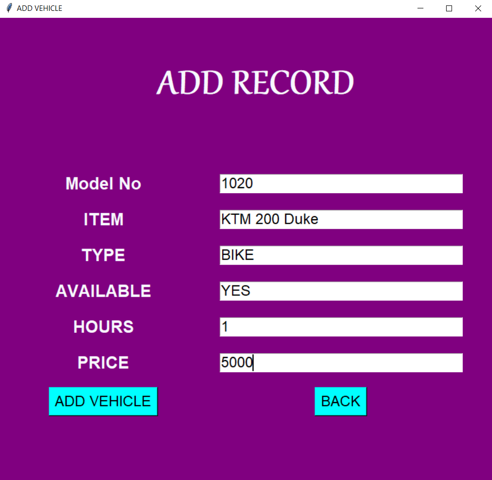
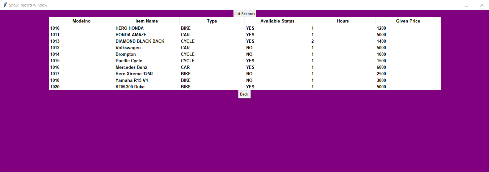
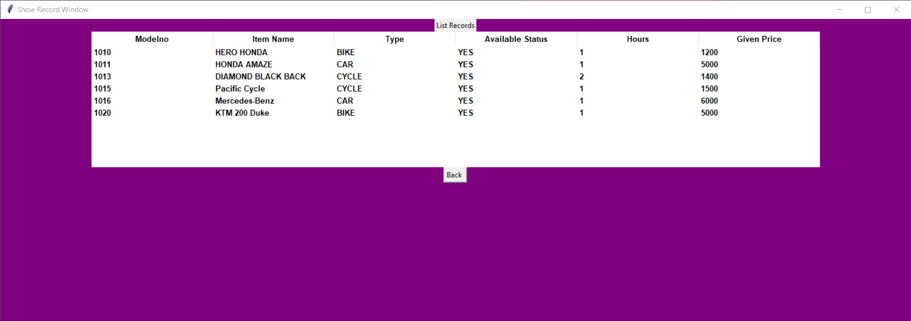
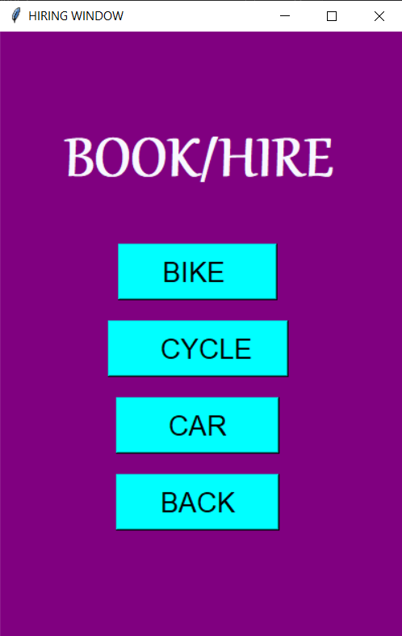
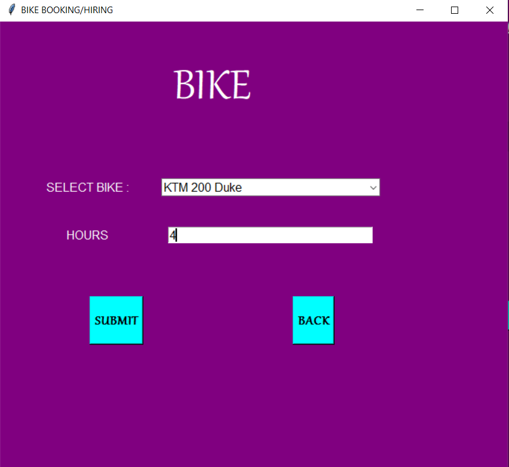
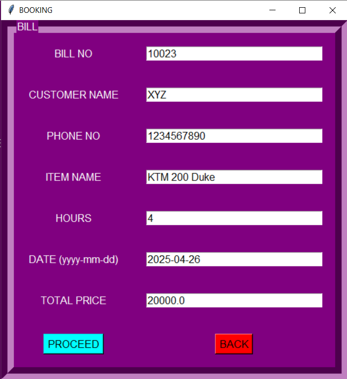
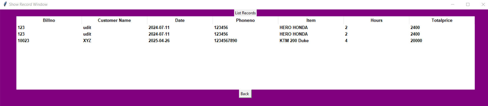
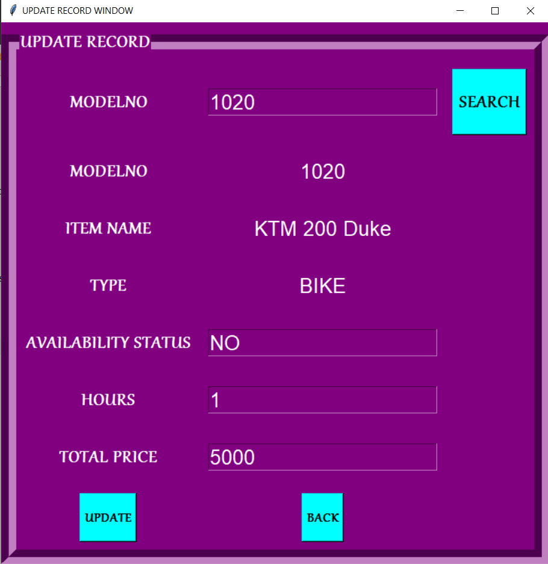

# Rapid Rental

A Tkinter-based application for efficient vehicle rental management, using **MySQL** for data storage. Rapid Rental simplifies input, tracking, and management of vehicles, customers, and rentals through a user-friendly interface.

---

## Tech Stack

- **Python**
- **MySQL**

---

## Features

- **Vehicle Management**:  
  Store and manage vehicle details — **Model No**, **Item Name**, **Type** (Bike/Car/Cycle), **Availability**, **Hours Available**, and **Price**.

- **Customer Records**:  
  Record customer information like **Name**, **Phone Number**, rental **Item Name**, **Hours**, **Rental Date (YYYY-MM-DD)**, and **Total Price**.

- **Rental & Billing Management**:  
  Track rental periods, generate **Billing Information** with **Bill No**, and calculate the **Total Price** automatically based on hours and vehicle pricing.

- **Update Record with Search**:  
  In the **Update Record Screen**, search for vehicle details based on **Model Number** to update existing records.

---
# How to Set Up and Run This Application

## 1. Set up Virtual Environment

```bash
python -m venv venv
```

Activate the virtual environment:

- On **Windows**:
  ```bash
  venv\Scripts\activate
  ```
- On **macOS/Linux**:
  ```bash
  source venv/bin/activate
  ```

---

## 2. Install Requirements

```bash
pip install -r requirements.txt
```

> (You mainly need `mysql-connector-python`.)

---

## 3. Set Up Database Credentials

- Open the `GlobalVariable.py` file.
- Update the file with your MySQL **username**, **password**, and **host** (e.g., `localhost` if using XAMPP).

---

## 4. Start MySQL Server

- Open **XAMPP Control Panel** (or your MySQL server application).
- Start the **MySQL** service.

---

## 5. Create Database and Tables

Run the following scripts to set up your database:

```bash
python Database&TableCreation.py
python ItemTables.py
```

- `Database&TableCreation.py`: Creates the database **rapidrental** and the first table `item`.
- `ItemTables.py`: Creates additional tables required for the application.

---

## 6. Launch the Application

Finally, run the application:

```bash
python RapidRental.py
```

Your Rapid Rental App is now ready! 🚗✨

---

## Screens

### Welcome Screen


### Main Screen


### Add Record Screen


> In **Add Record**, you can store:
> - Model No
> - Item Name
> - Type (Bike/Car/Cycle)
> - Available (Yes/No)
> - Hours
> - Price per Hour

### All Records Screen


### All Available Vehicles Records


### Hire Screen


### Bike/Car/Cycle Hiring Screen


> In **Hire Screen**, you select a vehicle and define hiring hours.

### Billing Screen


> In **Billing Screen**, you manage:
> - Bill No
> - Customer Name
> - Phone No
> - Item Name
> - Hours
> - Date (YYYY-MM-DD)
> - Total Price (calculated)

### All Customer Record


### Update Record Screen


> Update vehicle or customer details as needed.

---

## Author

Made by [**UditSax3na**](https://github.com/UditSax3na)

---
